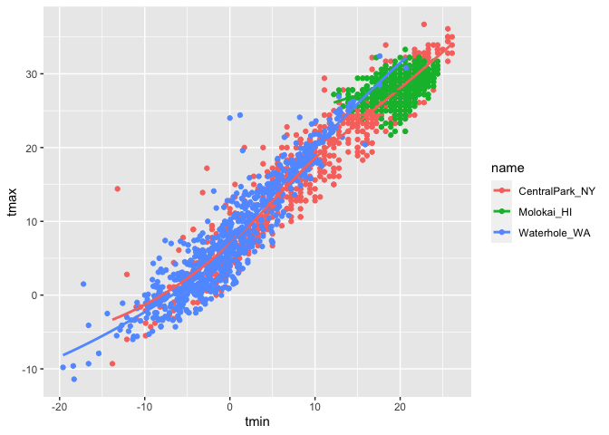
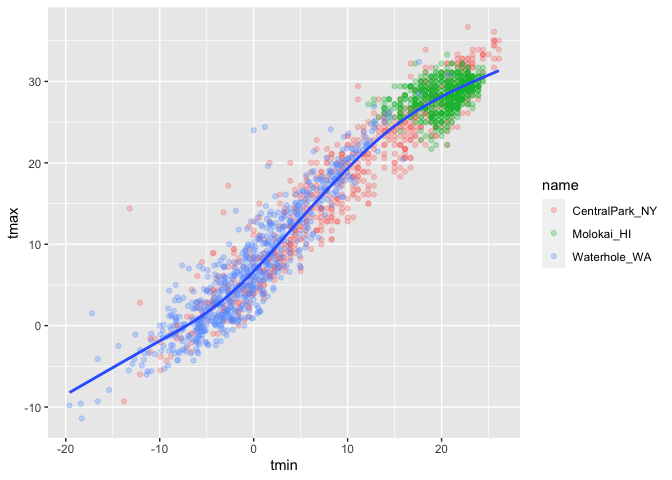
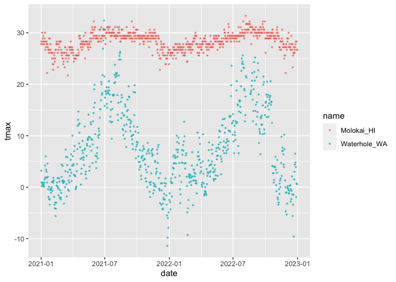
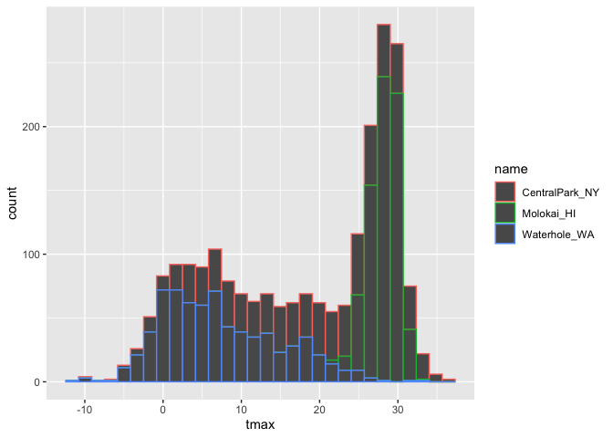

Visualization Part 1
================
Yuzhe Hu
2023-10-09

``` r
library(tidyverse)
```

    ## ── Attaching core tidyverse packages ──────────────────────── tidyverse 2.0.0 ──
    ## ✔ dplyr     1.1.3     ✔ readr     2.1.4
    ## ✔ forcats   1.0.0     ✔ stringr   1.5.0
    ## ✔ ggplot2   3.4.3     ✔ tibble    3.2.1
    ## ✔ lubridate 1.9.2     ✔ tidyr     1.3.0
    ## ✔ purrr     1.0.2     
    ## ── Conflicts ────────────────────────────────────────── tidyverse_conflicts() ──
    ## ✖ dplyr::filter() masks stats::filter()
    ## ✖ dplyr::lag()    masks stats::lag()
    ## ℹ Use the conflicted package (<http://conflicted.r-lib.org/>) to force all conflicts to become errors

``` r
library(ggridges)
```

Get the data for plotting today.

``` r
#这一步是自己在创建数据集，rnoaa是一个爬取数据的，后边的命令也是
weather_df = 
  rnoaa::meteo_pull_monitors(
    c("USW00094728", "USW00022534", "USS0023B17S"),
    var = c("PRCP", "TMIN", "TMAX"), 
    date_min = "2021-01-01",
    date_max = "2022-12-31") |>
  mutate(
    name = recode(
      id, 
      USW00094728 = "CentralPark_NY", 
      USW00022534 = "Molokai_HI",
      USS0023B17S = "Waterhole_WA"),
    tmin = tmin / 10,
    tmax = tmax / 10) |>
  select(name, id, everything())
```

    ## using cached file: /Users/huyuzhe/Library/Caches/org.R-project.R/R/rnoaa/noaa_ghcnd/USW00094728.dly

    ## date created (size, mb): 2023-09-21 12:48:44.087999 (8.524)

    ## file min/max dates: 1869-01-01 / 2023-09-30

    ## using cached file: /Users/huyuzhe/Library/Caches/org.R-project.R/R/rnoaa/noaa_ghcnd/USW00022534.dly

    ## date created (size, mb): 2023-10-09 17:21:38.762678 (0.282)

    ## file min/max dates: 2021-01-01 / 2023-10-31

    ## using cached file: /Users/huyuzhe/Library/Caches/org.R-project.R/R/rnoaa/noaa_ghcnd/USS0023B17S.dly

    ## date created (size, mb): 2023-09-21 12:48:49.119174 (0.994)

    ## file min/max dates: 1999-09-01 / 2023-09-30

Let’s make a plot!

\#scatterplot

``` r
ggplot(weather_df, aes(x = tmin, y = tmax)) + 
  geom_point()
```

    ## Warning: Removed 17 rows containing missing values (`geom_point()`).

<!-- -->

Pipes and stuff

``` r
weather_df |> 
  filter(name == "CentralPark_NY") |> 
  ggplot(aes(x = tmin, y = tmax)) + 
  geom_point()
```

<!-- -->

``` r
ggp_nyc_weather = 
  weather_df |> 
  filter(name == "CentralPark_NY") |> 
  ggplot(aes(x = tmin, y = tmax)) + 
  geom_point()
```

## Fancy plot

注意下边这两种把
color=name放在不同命令的aes里的运行结果，一种是画了三条线，一种是只画了一条线

``` r
ggplot(weather_df, aes(x = tmin, y = tmax, color = name)) + 
  geom_point() +
  geom_smooth(se = FALSE)
```

    ## `geom_smooth()` using method = 'loess' and formula = 'y ~ x'

    ## Warning: Removed 17 rows containing non-finite values (`stat_smooth()`).

    ## Warning: Removed 17 rows containing missing values (`geom_point()`).

<!-- -->

``` r
  ###geom_smooth用于加一条线,下边这个se是让这张图不画出confidence interval
```

``` r
ggplot(weather_df, aes(x = tmin, y = tmax)) + 
  geom_point(aes(color = name), alpha = 0.3) +
  geom_smooth(se = FALSE)
```

    ## `geom_smooth()` using method = 'gam' and formula = 'y ~ s(x, bs = "cs")'

    ## Warning: Removed 17 rows containing non-finite values (`stat_smooth()`).

    ## Warning: Removed 17 rows containing missing values (`geom_point()`).

<!-- -->

``` r
  ###geom_smooth用于加一条线,下边这个se是让这张图不画出confidence interval
```

Plot with facets

``` r
ggplot(weather_df, aes(x = tmin, y = tmax, color = name)) + 
  geom_point(alpha = .3, size = 0.5) + 
#alpha denotes transparency
  geom_smooth(size = 1.5)  + 
  facet_grid(. ~ name)
```

    ## Warning: Using `size` aesthetic for lines was deprecated in ggplot2 3.4.0.
    ## ℹ Please use `linewidth` instead.
    ## This warning is displayed once every 8 hours.
    ## Call `lifecycle::last_lifecycle_warnings()` to see where this warning was
    ## generated.

    ## `geom_smooth()` using method = 'loess' and formula = 'y ~ x'

    ## Warning: Removed 17 rows containing non-finite values (`stat_smooth()`).

    ## Warning: Removed 17 rows containing missing values (`geom_point()`).

<!-- -->

``` r
#最后一个指令～前半部分指行，后半部分指列，点的意思是不要画行（rows），按照列的方式来画，同样可以尝试将指令更改为(name～.)
```

``` r
#这里是根据tmin的大小来画点的深浅程度，或者说透明度
ggplot(weather_df, aes(x = tmin, y = tmax,alpha = tmin, color = name)) + 
  geom_point() + 
  geom_smooth()  + 
  facet_grid(. ~ name)
```

    ## `geom_smooth()` using method = 'loess' and formula = 'y ~ x'

    ## Warning: Removed 17 rows containing non-finite values (`stat_smooth()`).

    ## Warning: The following aesthetics were dropped during statistical transformation: alpha
    ## ℹ This can happen when ggplot fails to infer the correct grouping structure in
    ##   the data.
    ## ℹ Did you forget to specify a `group` aesthetic or to convert a numerical
    ##   variable into a factor?
    ## The following aesthetics were dropped during statistical transformation: alpha
    ## ℹ This can happen when ggplot fails to infer the correct grouping structure in
    ##   the data.
    ## ℹ Did you forget to specify a `group` aesthetic or to convert a numerical
    ##   variable into a factor?
    ## The following aesthetics were dropped during statistical transformation: alpha
    ## ℹ This can happen when ggplot fails to infer the correct grouping structure in
    ##   the data.
    ## ℹ Did you forget to specify a `group` aesthetic or to convert a numerical
    ##   variable into a factor?

    ## Warning: Removed 17 rows containing missing values (`geom_point()`).

<!-- -->

let’s try a different plot. temps are boring facet some things

``` r
ggplot(weather_df, aes(x = date, y = tmax, color = name)) + 
  # 下边这行代码的意思是点的大小根据降雨量的大小来确定
  geom_point(aes(size = prcp), alpha = .3) + 
  geom_smooth() + 
  facet_grid(. ~ name)
```

    ## `geom_smooth()` using method = 'loess' and formula = 'y ~ x'

    ## Warning: Removed 17 rows containing non-finite values (`stat_smooth()`).

    ## Warning: Removed 19 rows containing missing values (`geom_point()`).

<!-- -->

try assigning a specific color

``` r
weather_df |> 
  filter(name != "CentralPark_NY") |> 
  ggplot(aes(x = date, y = tmax, color = name)) + 
  geom_point(alpha = .7, size = .5)
```

    ## Warning: Removed 17 rows containing missing values (`geom_point()`).

<!-- -->

hex plot

``` r
weather_df |> 
  ggplot(aes(x = tmin, y = tmax)) + 
  geom_hex() 
```

    ## Warning: Removed 17 rows containing non-finite values (`stat_binhex()`).

<!-- -->

``` r
##can also try geom_density2d() or geom_bin2d()
```

``` r
weather_df |> 
  filter(name == "Molokai_HI") |> 
  ggplot(aes(x = date, y = tmax)) + 
  geom_line(alpha = .5) + 
  geom_point(size = .5)
```

    ## Warning: Removed 1 rows containing missing values (`geom_point()`).

<!-- -->

## Univariate plotting

单变量绘图 Histogram

``` r
ggplot(weather_df, aes(x = tmax)) + 
  geom_histogram()
```

    ## `stat_bin()` using `bins = 30`. Pick better value with `binwidth`.

    ## Warning: Removed 17 rows containing non-finite values (`stat_bin()`).

<!-- -->

Can we add colors to histogram?

``` r
ggplot(weather_df, aes(x = tmax, color = name)) + 
  geom_histogram()
```

    ## `stat_bin()` using `bins = 30`. Pick better value with `binwidth`.

    ## Warning: Removed 17 rows containing non-finite values (`stat_bin()`).

<!-- -->

``` r
ggplot(weather_df, aes(x = tmax, fill = name)) + 
#fill的意思是用不同的颜色进行填充
#dodege makes the histograms not stacking on each other
  geom_histogram(position = "dodge")
```

    ## `stat_bin()` using `bins = 30`. Pick better value with `binwidth`.

    ## Warning: Removed 17 rows containing non-finite values (`stat_bin()`).

<!-- -->

``` r
ggplot(weather_df, aes(x = tmax, fill = name)) + 
  geom_histogram() +
  facet_grid(.~ name)
```

    ## `stat_bin()` using `bins = 30`. Pick better value with `binwidth`.

    ## Warning: Removed 17 rows containing non-finite values (`stat_bin()`).

<!-- -->

let’s use a density plot it is actually a version of smoothed out
histograms adjust
相当于调整一个平滑参数的细节，也可以不加，r会按照系统内部默认的东西来进行

``` r
ggplot(weather_df, aes(x = tmax, fill = name)) + 
  geom_density(alpha = .3, adjust = .75)
```

    ## Warning: Removed 17 rows containing non-finite values (`stat_density()`).

<!-- -->

Boxplots 以下的每一个都可以在aes里添加fill=name，用来填充颜色
包括在boxplot的框里添加alpha值来调整填充颜色的透明度

``` r
ggplot(weather_df, aes(y = tmax, x = name)) + 
  geom_boxplot()
```

    ## Warning: Removed 17 rows containing non-finite values (`stat_boxplot()`).

<!-- --> Trendy plots
Violin plots

``` r
ggplot(weather_df, aes(y = tmax, x = name, fill = name)) + 
  geom_violin(alpha = .5)
```

    ## Warning: Removed 17 rows containing non-finite values (`stat_ydensity()`).

<!-- -->

``` r
##如果想要加一个统计值，比如说中位数
ggplot(weather_df, aes(y = tmax, x = name, fill = name)) + 
  geom_violin(alpha = .5) +
  stat_summary(fun = "median")
```

    ## Warning: Removed 17 rows containing non-finite values (`stat_ydensity()`).

    ## Warning: Removed 17 rows containing non-finite values (`stat_summary()`).

    ## Warning: Removed 3 rows containing missing values (`geom_segment()`).

<!-- -->

``` r
##如果不加括号内的指定，只写了stat_summary(),会给出一个关于均值的结果图
```

ridge plot

``` r
ggplot(weather_df, aes(x = tmax, y = name)) + 
  geom_density_ridges()
```

    ## Picking joint bandwidth of 1.54

    ## Warning: Removed 17 rows containing non-finite values
    ## (`stat_density_ridges()`).

<!-- -->

## saving and embedding plots

``` r
ggp_weather =   
  weather_df |> 
  ggplot(aes(x = tmin, y = tmax, color = name)) + 
  geom_point()

ggsave("./ggp_weather.pdf", ggp_weather, width = 8, height = 5)
```

    ## Warning: Removed 17 rows containing missing values (`geom_point()`).

``` r
##也可以保存成png形式
```

What about embedding..

``` r
ggp_weather
```

    ## Warning: Removed 17 rows containing missing values (`geom_point()`).

<!-- -->

Embed at different size.

``` r
ggp_weather
```

    ## Warning: Removed 17 rows containing missing values (`geom_point()`).

<!-- -->
