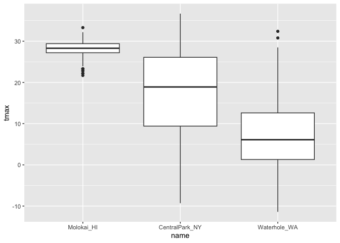
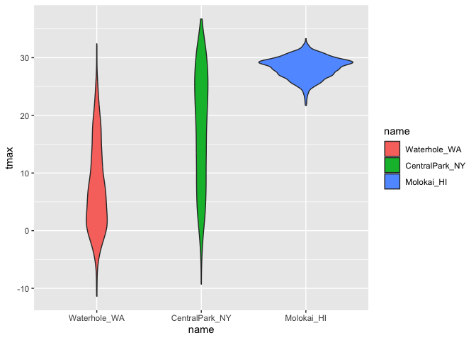
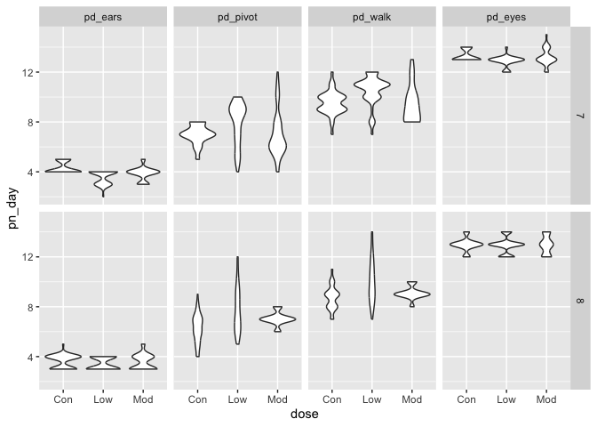

Part_2
================
Yuzhe Hu
2023-10-10

``` r
library(tidyverse)
```

    ## ── Attaching core tidyverse packages ──────────────────────── tidyverse 2.0.0 ──
    ## ✔ dplyr     1.1.3     ✔ readr     2.1.4
    ## ✔ forcats   1.0.0     ✔ stringr   1.5.0
    ## ✔ ggplot2   3.4.3     ✔ tibble    3.2.1
    ## ✔ lubridate 1.9.2     ✔ tidyr     1.3.0
    ## ✔ purrr     1.0.2     
    ## ── Conflicts ────────────────────────────────────────── tidyverse_conflicts() ──
    ## ✖ dplyr::filter() masks stats::filter()
    ## ✖ dplyr::lag()    masks stats::lag()
    ## ℹ Use the conflicted package (<http://conflicted.r-lib.org/>) to force all conflicts to become errors

``` r
library(patchwork)
```

Get the data for plotting today.

``` r
weather_df = 
  rnoaa::meteo_pull_monitors(
    c("USW00094728", "USW00022534", "USS0023B17S"),
    var = c("PRCP", "TMIN", "TMAX"), 
    date_min = "2021-01-01",
    date_max = "2022-12-31") |>
  mutate(
    name = recode(
      id, 
      USW00094728 = "CentralPark_NY", 
      USW00022534 = "Molokai_HI",
      USS0023B17S = "Waterhole_WA"),
    tmin = tmin / 10,
    tmax = tmax / 10) |>
  select(name, id, everything())
```

    ## using cached file: /Users/huyuzhe/Library/Caches/org.R-project.R/R/rnoaa/noaa_ghcnd/USW00094728.dly

    ## date created (size, mb): 2023-09-21 12:48:44.087999 (8.524)

    ## file min/max dates: 1869-01-01 / 2023-09-30

    ## using cached file: /Users/huyuzhe/Library/Caches/org.R-project.R/R/rnoaa/noaa_ghcnd/USW00022534.dly

    ## date created (size, mb): 2023-10-09 17:21:38.762678 (0.282)

    ## file min/max dates: 2021-01-01 / 2023-10-31

    ## using cached file: /Users/huyuzhe/Library/Caches/org.R-project.R/R/rnoaa/noaa_ghcnd/USS0023B17S.dly

    ## date created (size, mb): 2023-09-21 12:48:49.119174 (0.994)

    ## file min/max dates: 1999-09-01 / 2023-09-30

This results in a dataframe with 2190 observations on six variables.

## Same plot from last time

``` r
weather_df |> 
  ggplot(aes(x = tmin, y = tmax, color = name)) + 
  geom_point(alpha = .5) + 
  labs(
    title = "Temperature plot",
    x = "Min daily temp (Degrees C)",
    y = "Max daily temp",
    color = "Location",
    caption = "Max vs min daily temp in three locations; data from rnoaa"
  )
```

    ## Warning: Removed 17 rows containing missing values (`geom_point()`).

<!-- -->

## Scales

For x and y scales

``` r
weather_df |> 
  ggplot(aes(x = tmin, y = tmax, color = name)) + 
  geom_point(alpha = .5) + 
  labs(
    title = "Temperature plot",
    x = "Min daily temp (Degrees C)",
    y = "Max daily temp",
    color = "Location",
    caption = "Max vs min daily temp in three locations; data from rnoaa"
  ) + 
  scale_x_continuous(
    breaks = c(-15, 0, 15),
    labels = c("-15 C", "0", "15")
  ) + 
  scale_y_continuous(
    position = "right", ##把坐标轴放到右边
    trans = "sqrt"
  )
```

    ## Warning in self$trans$transform(x): NaNs produced

    ## Warning: Transformation introduced infinite values in continuous y-axis

    ## Warning: Removed 142 rows containing missing values (`geom_point()`).

<!-- -->

Look at color scale

``` r
weather_df |> 
  ggplot(aes(x = tmin, y = tmax, color = name)) + 
  geom_point(alpha = .5) + 
  labs(
    title = "Temperature plot",
    x = "Min daily temp (Degrees C)",
    y = "Max daily temp",
    color = "Location",
    caption = "Max vs min daily temp in three locations; data from rnoaa"
  ) + 
  viridis::scale_color_viridis(discrete = TRUE)
```

    ## Warning: Removed 17 rows containing missing values (`geom_point()`).

<!-- -->

``` r
# 因为scale_color_viridis命令默认变量是连续的，如果要应用到离散变量上需要写出来discrete = TRUE
```

## Themes

theme_bw()用于更改图示的灰色背景为黑白色

``` r
weather_df |> 
  ggplot(aes(x = tmin, y = tmax, color = name)) + 
  geom_point(alpha = .5) + 
  labs(
    title = "Temperature plot",
    x = "Min daily temp (Degrees C)",
    y = "Max daily temp",
    color = "Location",
    caption = "Max vs min daily temp in three locations; data from rnoaa"
  ) + 
  viridis::scale_color_viridis(discrete = TRUE) + 
  theme_bw()
```

    ## Warning: Removed 17 rows containing missing values (`geom_point()`).

<!-- -->

``` r
weather_df |> 
  ggplot(aes(x = tmin, y = tmax, color = name)) + 
  geom_point(alpha = .5) + 
  labs(
    title = "Temperature plot",
    x = "Min daily temp (Degrees C)",
    y = "Max daily temp",
    color = "Location",
    caption = "Max vs min daily temp in three locations; data from rnoaa"
  ) + 
  viridis::scale_color_viridis(discrete = TRUE) + 
  ##theme_minimal是另外一种不同的主题，有很多种不同的主题可以进行选择
  theme_minimal() + 
  theme(legend.position = "bottom") ##把右侧的注释不同点的类型移到图表的最下方
```

    ## Warning: Removed 17 rows containing missing values (`geom_point()`).

<!-- -->
这些不同的theme都存在于ggthemes里 可以试一试ggthemes::theme_excel();
ggthemes::theme_economics() ggthemes::theme_classic()

## Setting Options

这一段讲的是在每一个rmarkdown文件的开头放这些东西后，后边的图片会自动变成相应的格式，不用一个一个进行指定了

``` r
library(tidyverse)

#指定图片的输出方式，纵横比，outwidth的意思是不让图片充满，而是距离边界有点地方
knitr::opts_chunk$set(
  fig.width = 6,
  fig.asp = .6,
  out.width = "90%"
)

#图片的颜色主题，以及表注的位置
theme_set(theme_minimal() + theme(legend.position = "bottom"))

#输出连续变量时的边框及内部填充的色谱颜色
options(
  ggplot2.continuous.colour = "viridis",
  ggplot2.continuous.fill = "viridis"
)

#输出离散变量时的边框及内部填充的色谱颜色
scale_colour_discrete = scale_colour_viridis_d
scale_fill_discrete = scale_fill_viridis_d
```

## data argument in ‘geom’

``` r
nyc_weather_df = 
  weather_df |> 
  filter(name == "CentralPark_NY")

hawaii_weather_df = 
  weather_df |> 
  filter(name == "Molokai_HI")

ggplot(nyc_weather_df, aes(x = date, y = tmax, color = name)) + 
  geom_point() + 
  geom_line(data = hawaii_weather_df)
```

<!-- -->

## `patchwork`

``` r
weather_df |> 
  ggplot(aes(x = date, y = tmax, color = name)) + 
  geom_point() + 
  facet_grid(. ~ name)
```

    ## Warning: Removed 17 rows containing missing values (`geom_point()`).

<!-- -->

What happens when you want multipanel plots but can’t facet?
patchwork-拼凑图案

``` r
ggp_temp_scatter = 
  weather_df |> 
  ggplot(aes(x = tmin, y = tmax, color = name)) + 
  geom_point(alpha = .5) + 
  theme(legend.position = "none")

ggp_prcp_density = 
  weather_df |> 
  filter(prcp > 25) |> 
  ggplot(aes(x = prcp, fill = name)) + 
  geom_density(alpha = .5) + 
  theme(legend.position = "none")

ggp_tmax_date = 
  weather_df |> 
  ggplot(aes(x = date, y = tmax, color = name)) + 
  geom_point() + 
  geom_smooth(se = FALSE) + 
  theme(legend.position = "bottom")

(ggp_temp_scatter + ggp_prcp_density) / ggp_tmax_date
```

    ## Warning: Removed 17 rows containing missing values (`geom_point()`).

    ## `geom_smooth()` using method = 'loess' and formula = 'y ~ x'

    ## Warning: Removed 17 rows containing non-finite values (`stat_smooth()`).
    ## Removed 17 rows containing missing values (`geom_point()`).

<!-- -->

``` r
#其实展示了怎么讲不同的图案拼在一张图内
#记得加上library(patchwork)这个是放在最前面了
#ggp_temp_scatter + ggp_prcp_density + ggp_tmax_date
#ggp_temp_scatter +（ggp_prcp_density + ggp_tmax_date）
```

## data manipulation

这个地方主要讲的是如果想换boxplot，violin
plot里边各个变量的位置时，r的底层逻辑是把先遇到的那个变量记做1，2，3，。。然后画图，这里边的逻辑是缓一缓变量的顺序。

``` r
weather_df |> 
  mutate(
    name = forcats::fct_relevel(name, c("Molokai_HI", "CentralPark_NY", "Waterhole_WA"))
  ) |> 
  ggplot(aes(x = name, y = tmax)) + 
  geom_boxplot()
```

    ## Warning: Removed 17 rows containing non-finite values (`stat_boxplot()`).

<!-- -->

``` r
weather_df |> 
  mutate(
    name = fct_reorder(name, tmax)
  ) |> 
  ggplot(aes(x = name, y = tmax, fill = name)) + 
  geom_violin()
```

    ## Warning: There was 1 warning in `mutate()`.
    ## ℹ In argument: `name = fct_reorder(name, tmax)`.
    ## Caused by warning:
    ## ! `fct_reorder()` removing 17 missing values.
    ## ℹ Use `.na_rm = TRUE` to silence this message.
    ## ℹ Use `.na_rm = FALSE` to preserve NAs.

    ## Warning: Removed 17 rows containing non-finite values (`stat_ydensity()`).

<!-- --> what if I
want to show tmin and tmax in a same graph

``` r
weather_df |>
  select(name, tmax, tmin) |> 
  pivot_longer(
    tmax:tmin,
    names_to = "observation", 
    values_to = "temp") |> 
  ggplot(aes(x = temp, fill = observation)) +
  geom_density(alpha = .5) + 
  facet_grid(~name) + 
  viridis::scale_fill_viridis(discrete = TRUE)
```

    ## Warning: Removed 34 rows containing non-finite values (`stat_density()`).

<!-- -->

## Revisit the pulbs

complicate FAS plot

``` r
litters_df =
  read_csv("data/FAS_litters.csv") |> 
  janitor::clean_names() |> 
  separate(group, into = c("dose", "day_of_tx"), sep = 3)
```

    ## Rows: 49 Columns: 8
    ## ── Column specification ────────────────────────────────────────────────────────
    ## Delimiter: ","
    ## chr (2): Group, Litter Number
    ## dbl (6): GD0 weight, GD18 weight, GD of Birth, Pups born alive, Pups dead @ ...
    ## 
    ## ℹ Use `spec()` to retrieve the full column specification for this data.
    ## ℹ Specify the column types or set `show_col_types = FALSE` to quiet this message.

``` r
pups_df = 
  read_csv("data/FAS_pups.csv") |> 
  janitor::clean_names() |> 
  mutate(sex = recode(sex, `1` = "male", `2` = "female"))
```

    ## Rows: 313 Columns: 6
    ## ── Column specification ────────────────────────────────────────────────────────
    ## Delimiter: ","
    ## chr (1): Litter Number
    ## dbl (5): Sex, PD ears, PD eyes, PD pivot, PD walk
    ## 
    ## ℹ Use `spec()` to retrieve the full column specification for this data.
    ## ℹ Specify the column types or set `show_col_types = FALSE` to quiet this message.

``` r
fas_df =
  left_join(pups_df, litters_df, by = "litter_number")

fas_df |> 
  select(dose, day_of_tx, starts_with("pd")) |> 
  pivot_longer(
    pd_ears:pd_walk, 
    names_to = "outcome", 
    values_to = "pn_day"
  ) |> 
  drop_na() |> 
  mutate(outcome = fct_reorder(outcome, pn_day)) |> 
#mutate(outcome = forcats::fct_relevel(outcome,"pd_ears", "pd_pivot","pd_walk","pd_eyes"))没搞懂这些命令里的具体细节
  ggplot(aes(x = dose, y = pn_day)) +
  geom_violin() + 
  facet_grid(day_of_tx ~ outcome)
```

<!-- -->
